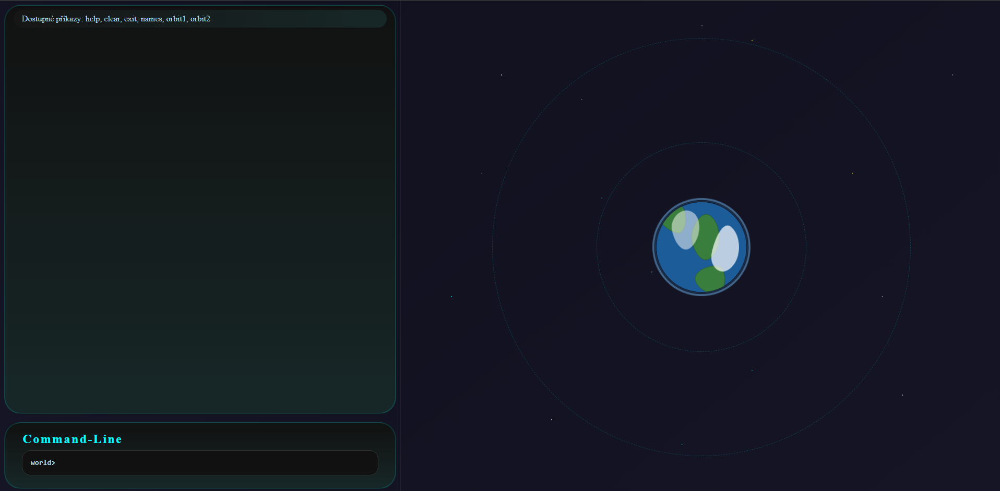
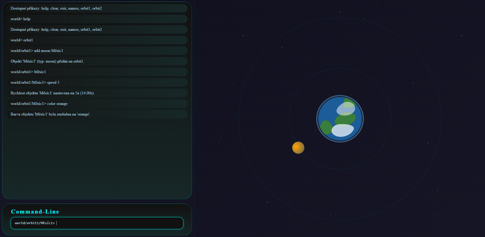
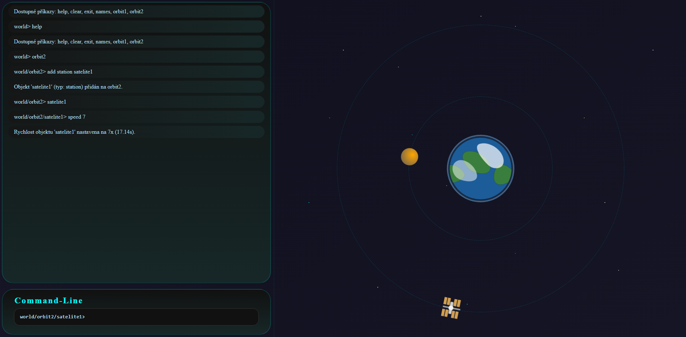

# CMD-project

## Simulace Vesmíru

### Žáci: *Nicolas Doktor, Robert Mikloš*

## Ukázkový scénář použití:
> help

_Konzole ti vypíše možnosti komandů_

> orbit1
>
> orbit2

_Vybereš si třeba **orbit1**_

_Konzole se ti přepne do světa orbit1_
- napiš help pro zobrazení komandů

_Konzole ti vypíše možnosti komandů_

> add moon (Jméno) = objeví se měsíc
>
> remove (Jmeno) = zmizí měsíc
>
> add station (jméno)= objeví se satelit
>
> remove (Jméno) = zmizí satelit
>
> names - ukáže ti jména objektů

_Pokuď jsi uvnitř orbit1 nebo orbit2 a napíšeš (Jméno) objektu přepneš se v konzoli na př:World>Orbit1>Měsíc1_
- napiš help pro zobrazení komandů

> speed 5
>
>color orange
>

--- 

## Funkční požadavky:
textová konzole (CLI),  
příkazy zadávané uživatelem,  
textová odezva systému,  
minimálně jeden řízený objekt,  
možnost dotazovat se na stav objektu,  
možnost měnit stav objektu 

## Technologie:
Javascript  
HTML  
CSS  
Markdown  
Json

### Obrázky:

