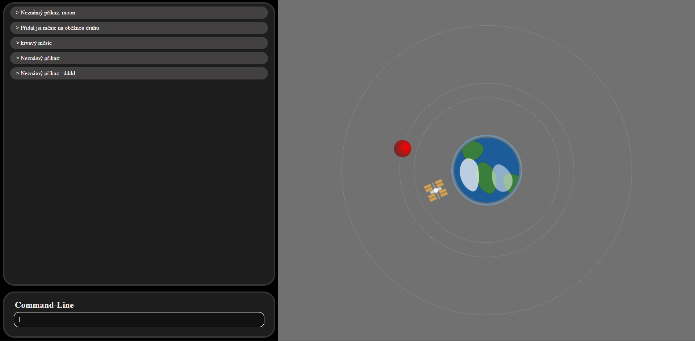

# CMD-project

## Simulace Vesmíru

### Žáci: *Nicolas Doktor, Robert Mikloš*

## Ukázkový scénář použití:
> !help

_Konzole ti vypíše možnosti komandů_

> !moon
>
> !satelite
>
> !rocket 

_Vybereš si třeba **!moon**_

_Konzole ti vypíše možnosti komandů_

> !moonup = objeví se měsíc
>
> !moondelete = zmizí měsíc
>
> !bloodmoon = objeví se krvavý měsíc

--- 

## Funkční požadavky:
textová konzole (CLI),  
příkazy zadávané uživatelem,  
textová odezva systému,  
minimálně jeden řízený objekt,  
možnost dotazovat se na stav objektu,  
možnost měnit stav objektu  

## Technologie:
Javascript  
HTML  
CSS  
Markdown  
Json

